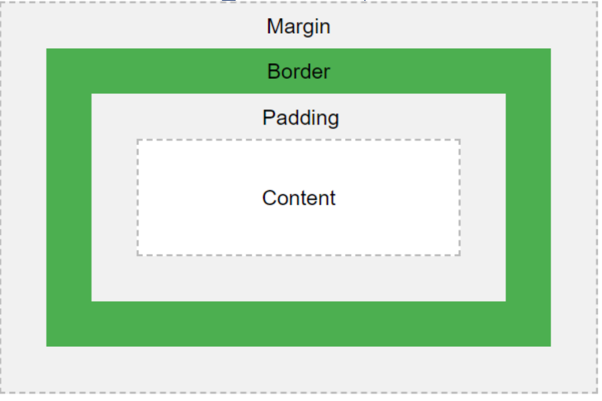

# CSS
Incluindo arquivo .css externo:
```html
<link rel="stylesheet" href="./arq.css">
```

## Seletores
- Universal (*)
- De elemento html (nome da tag)
  - Aplica a regra diretamente para uma determinada tag da página
- De ID (#id-do-elemento)
  - Aplica a regra ao elemento com o id específico
- De classe (.nome-da-classe)
  - Aplica a regra a todos os elementos da classe
- Descendente geral
  - Todos os elementos dentro do outro terão aquele estilo
  - ```tagPai tagFilho```
- Descendente direto
  - Apenas os filhos diretos
  - ```tagPai > tagFilho ```
- Irmão geral
  - Todos os vizinhos do mesmo nível
  - ```tag1 ~ tag2```
- Irmão adjacente
  - Apenas o vizinho imediato (posterior)
  - ```tag1 + tag2```
- Pseudo-classe
  - Define um estado especial de um elemento (ex: ao passar o mouse por cima, link visitado, em foco etc.)
  - ```a:link``` (não visitado)
  - ```a:visited``` (visitado)
  - ```a:hover``` (quando o cursor está por cima, pode ser em qualquer elem.)
  - ```a:active``` (link assim que é ativado)
- Pseudo-elementos
  - Partes específicas de um elemento
  - Primeira letra/linha: ```a:first-line```, ```a:first-letter```
  - Antes ou depois de um elemento: ```a.before```, ```a.after```
- Atributos
  - Estiliza as tags que tiverem os atributos com um valor específico
  - Ex: ```a[target="_blank"] {}```
- Agrupamento
  - Vários seletores em uma única linha
  - Ex: ```h1, h2, p {}```

Em caso de **empate**:
1. ```!important```
2. ```style=""```
3. ```id```
4. ```class```, ```attribute```, ```pseudo-class```
5. ```type```, ```pseudo-element```

## Cores
- Nome da cor
- RGB/RGA
- Hexadecimal
- HSL/HSA

## Fontes
- ```color```
- ```font-family```
- ```font-weight```
- ```font-style```: normal, itálico
- ```font-align```
- ```text-decoration```: add./rem. linhas em volta do texto (ex: *none* remove a linha embaixo do link)
- ```text-indent```: indentação do parágrafo

## Fundo
- ```background-color```
- ```background-image```
- ```background-repeat```: regra de repetição da imagem
- ```background-attachment```: regra de rolagem da imagem
- ```background-position```

## Box Model
- Content
- Padding
- Border
- Margin
  


**Aplicação trbl**: notação abreviada sentido horário, a partir do topo

### Bordas
- ```border-style```: *solid*,*dotted*, *dashed*, *double*, etc.
- ```border-color```
- ```border-radius```: arredondamento
- ```border-width```: 1, 2 ou 4 valores
- OBS: sua notação abreviada não é a mesma que as outras boxes, tem que usar ```border-top``` etc. indiv.

## Unidades
- Absolutas: 
  - *px*
  - *cm*
  - *mm*
- Relativas:
  - Viewport:
    - *vh* (altura/100)
    - *vw* (largura/100)
    - *vmin* (em ref. a janela)
    - *vmax* (em ref. a janela)
  - Fonte:
    - *em*: em relação ao elem. pai
    - *rem*: em rel. ao elem. avô
- Percentuais:
  - *%*: em ref. ao elem. pai

## Listas
- ```list-style-type```: estilo do marcador (*circle*, *square*, etc.)
- ```list-style-image```: usa uma imagem como marcador

## Display
- Forma de exibição do elemento na tela
- *block*: pula uma linha no final
- *inline*: não pula a linha e não permite configurar o tamanho do elemento
- *none*: desaparece o elemento

## Position
- Especifica o posicionamento na tela (*top*, *left*, *right*, *bottom*)
- *static*: padrão
- *relative*: pos. em relação ao local padrão
- *absolute*: pos. em relação ao seu ancestral
- *fixed*: posição em relação ao viewport (janela)
- *sticky*: *relative* + *fixed*