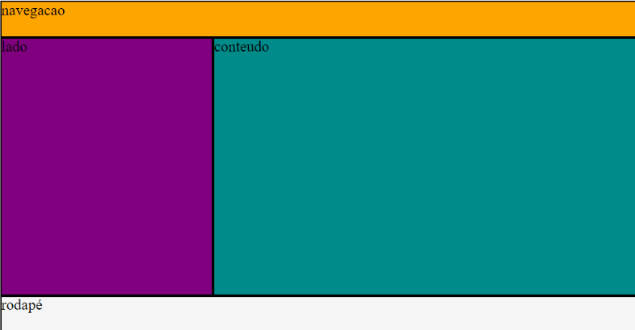
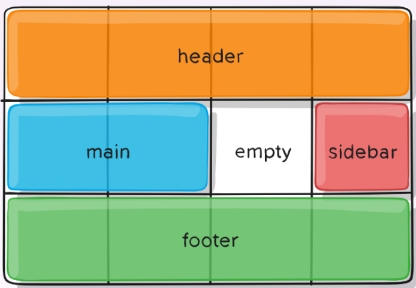

# Design Responsivo
## Flexbox
Definição: ```display: flex;```

Um container *flex box* contém *flex items*.

Principais propriedades do display flex:
- ```flex-direction```: direção dos itens no container (*column*, *row*, *column-reverse*, *row-reverse*)
- ```flex-wrap```: define se o layout deve quebrar em várias linhas quando há estouro na largura (*wrap*, *nowrap*, *wrap-reverse*)
- ```flex-flow```: notação abreviada para definir o direction e wrap
- ```justify-content```: alinha os itens flex na direção do eixo x (*center*, *flex-end*, *flex-start*, *space-around*, *space-between*, *space-evenly*)
- ```align-items```: alinha os itens flex na direção do eixo y (*center*, *flex-end*, *flex-start*, *baseline*)

Principais propriedades dos flex items:
- ```order```: altera a ordem padrão dos itens dentro do container (valor numérico)
- ```flex-grow```: determina o quanto um item irá expandir em relação aos outros itens (valor numérico)
- ```flex-shrink```: determina o quanto um item irá encolher em relação aos outros itens (valor numérico)
- ```flex-basis```: especifica o tamanho inicial para um item (valor em px)
- ```flex-property```: notação abreviada para o grow, shrink e basis
- ```align-self```: especifica o alinhamento do item dentro do container (*auto*, *flex-start*, *flex-end*, *center*, *baseline*, *stretch*)

## Grid
Sistema de layout bidimensional (linhas e colunas), diferente do flexbox que é unidirecional (colunas).

Definição: ```display: grid;```

Principais propriedades do display grid:
- ```grid-template-colums```: define o número total de colunas na grid
- ```grid-template-rows```: define o número total de linhas na grid
- ```grid-template-areas```: define áreas específicas no grid, usado em conjunto com o grid-area p/ def. os itens do grid
- ```justify-content```: alinha os itens do grid em relação ao eixo x (horiz.)
- ```align-content```: alinha os itens do grid em relação ao eixo y (vert.)
- ```grid-gap```: define o espaço entre os elementos da grid

Exemplos:
```css
grid-template-colums: 100px 100px 100px 100px; /* Define quatro colunas de 100px de larg. */
```
```css
grid-template-colums: 1fr 2fr; /* Duas colunas, a segunda o dobro do tamanho da primeira */
```

Após a especificação de um nome para cada elemento via ```grid-area```, a propriedade ```grid-template-areas``` é usada para mapear as linhas e colunas definidas. Por exemplo:
```css
nav{
    grid-area: nav;
    background-color: orange;
}

aside{
    grid-area: side;
    background-color: purple;
}
section{
    grid-area: content;
    background-color: darkcyan;
}
footer{
    grid-area: foot;
    background-color: whitesmoke;
}

.grid-container{
    display: grid;
    grid-template-columns: 1fr 2fr;
    grid-template-rows: 10% 70% 10%;
    height: 90vh;
    grid-template-areas:
        "nav nav"
        "side content"
        "foot foot";
} /* O mapeamento é como se fosse uma matriz, por isso repete nav e foot*/
```



**OBS**: "." pode ser usado para criar áreas vazias

```css
.item-a{grid-area: header;}
.item-b{grid-area: main;}
.item-c{grid-area: sidebar;}
.item-d{grid-area: footer;}
.container{
    display: grid;
    grid-template-columns: 50px 50px 50px 50px;
    grid-template-rows: auto;
    grid-template-areas:
        "header header header header"
        "main main . sidebar"
        "footer footer footer footer";
}
```


## Media Queries
Filtros que podem ser aplicados a estilos CSS com base nas características do dispositivo.

Formato:
```css
@media(query){
    /* CSS  */
}
```

**Mobile first**: iniciaremos o design do layout a partir da versão mobile pois possue mais restrições, e depois espandimos os recursos para desktop.

Parâmetros possíveis:
- ```min-width```: regras aplicadas para qualquer largura **maior** que o valor def.
  - Mais utilizado no mobile first
- ```max-width```: regras aplicadas para qualquer largura **menor** que o valor def.
- ```min-height```: regras aplicadas para qualquer altura maior que o valor def.
- ```max-height```: regras aplicadas para qualquer altura menor que o valor def.
- ```orientation=portrait```: regras aplicadas quando a altura é maior que a largura
- ```orientation=landscape``` regras aplicadas quando a largura é maior que a altura

Exemplo:
```css
@media(min-width: 350px){
    .extra-menu{
        display: block;
    }
}
```

**OBS**: media queries também podem ser incluídas por meio de um link usando arquivos de CSS dedicados. Por exemplo:
```html
<link rel="stylesheet" media="(max-width=640px)" href="max-640px.css">
<link rel="stylesheet" media="(min-width=640px)" href="min-640px.css">
<link rel="stylesheet" media="(orientation=portrait)" href="portrait.css">
<link rel="stylesheet" media="(orientation=landscape)" href="landscape.css">
```

**NORMALIZE.CSS**: normaliza os arquivos css para ficarem idênticos em todos os navegadores.