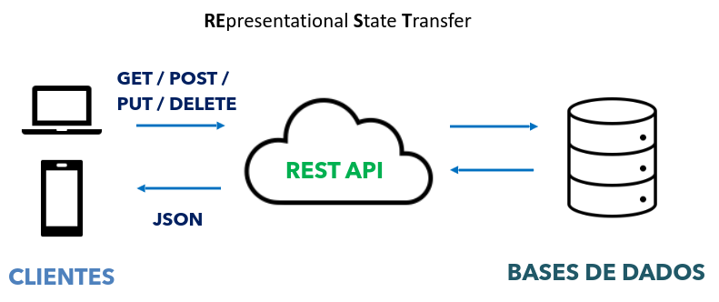
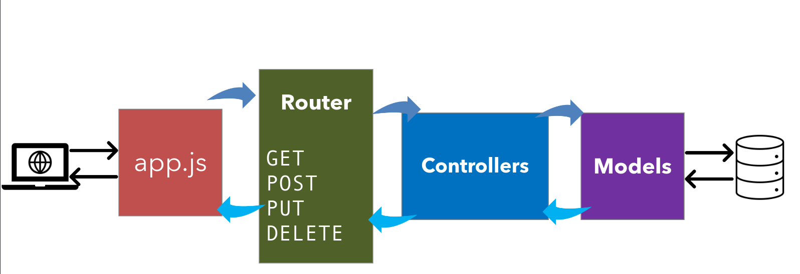

# Arquitetura Web
## Service-Oriented Architecture (SOA)
Arquitetura para desenvolvimento de sistemas distribuídos em que os componentes são serviços independentes, caracterizada por:
- **Acoplamento fraco**: uma mudança efetuada em um componente não deve afetar outros;
- **Interoperabilidade**: toda troca de mensagem é independente da plataforma;
- **Reuso**: os serviços são utilizados por diversos clientes;
- **Capacidade de descoberta**: o ambiente de execução e contrato de um serviço devem ser identificados e vinculados durante a execução.

## Web Services
Um **Web Service** é um componente de software reutilizável, fracamente acoplado, que encapsula funcionalidades discretas, pondendo ser distribuído e acessado programaticamente; é uma forma de implementar uma SOA.

É acessado usando protocolos padrões da Internet e arquivos (geralmente XML ou JSON), independente da plataforma e da linguagem de programação. Podem ser implementados usando **SOAP** ou **REST**.

### Simple Object Access Protocol (SOAP)
Especificação de protocolo de mensagens para troca de informações estruturadas,  cujos serviços são baseados em comunicação por mensagens XML.

Usa a **WSDL** (Web Service Definition Language) para especificar a interface de serviços por descrições em formato XML, que define:
- Quais operações o serviço suporta e o formato das mensagens relacionadas;
- Onde o serviço está localizado.

```html
<wsdl:portType name="ICalculator">
    <wsdl:operation name="Add">
        <wsdl:input wsaw:Action="http://Example.org/ICalculator/Add"
            message="tns:ICalculator_Add_InputMessage" />
        <wsdl:output wsaw:Action="http://Example.org/ICalculator/AddResponse"
            message="tns:ICalculator_Add_OutputMessage" />
    </wsdl:operation>

    <wsdl:operation name="Subtract">
        <wsdl:input wsaw:Action="http://Example.org/ICalculator/Subtract"
            message="tns:ICalculator_Subtract_InputMessage" />
        <wsdl:output wsaw:Action="http://Example.org/ICalculator/
        SubtractResponse"
            message="tns:ICalculator_Subtract_OutputMessage" />
    </wsdl:operation>
</wsdl:portType>
```

Os XMLs especificados pelo SOAP seguem um padrão definido dentro do protocolo, que serve para que um objeto possa ser serializado paa XML e vice-versa.

A serialização de objetos tem como objetivo formar uma mensagem SOAP, composta pelo objeto denominado *envelope SOAP*, ou **SOAP-ENV**. Dentro desse envelope há dois componentes:
- **Header SOAP** (cabeçalho): possui informações de atributos de metadados da requisição, como IP de origem, dados de autenticação etc.;
- **SOAP Body**: possui informações referentes à requisição, nomes dos métodos que deseja se invocar e o objeto serializado que será enviado na requisição.

```html
<?xml version="1.0"?>
<soap:Envelope xmlns:soap="http://www.w3.org/2003/05/soap-
envelope">
    <soap:Header>
    </soap:Header>

    <soap:Body>
        <m:GetRevista xmlns:m="http://www.servicoxyz.com/ws/revista">
            <m:RevistaNome>Veja</m:RevistaNome>
            <m:RevistaAno>1999</m:RevistaAno>
            <m:RevistaMes>5</m:RevistaMes>
        </m:GetRevista>
    </soap:Body>
</soap:Envelope>
```

O problema desse padrão é que ele adiciona um overhead considerável, pois adiciona muitas tags de metainformação e as serializações e desserializações podem consumir um tempo considerável.

Uma vantagem é que não limita o protocolo de comunicação utilizado para a troca de mensagens.


### Representational State Transfer (REST)
Estilo arquitetural baseado na transferência de representações de recursos de um servidor para um cliente. É mais simples que o SOAP/WSDL para implementar serviços Web.



Princípios:
1. **Cliente-Servidor**:
   - Cliente e servidor são separados por uma interface uniforme. O cliente não precisa se preocupar em como os dados são armazenados e manipulados no servidor, e o desenvolvimento entre partes é independente;
   - Mensagens HTTP:
     - Verbos HTTP:
       - `GET`: lê recursos;
       - `PUT`: modifica ou cria um recurso;
       - `DELETE`: apaga recursos;
       - `POST`: cria um recurso;
     - URI: `http://enderecowebservice/Recurso/{IdRecurso}`, não deve conter verbos.
   - Dados: JSON ou XML.
2. Stateless (Sem Estado):
   - O servidor não guarda o estado da aplicação para nenhum cliente, de forma que cada requisição deve enviar toda informação necessária para seu entendimento (toda requisição deve ser autossuficiente).
3. Cache:
   - Armazena resultados gerados temporariamente em vez de gerá-los novamente para a mesma requisição.
4. Sistema em Camadas;
5. Código sob Demanda:
   - Servidores podem retornar pedaços de código (scripts) para serem executados no cliente.
6. Interface Uniforme (restrições):
    1. Identificação de recursos:
       - Recursos devem ser acessados por meio de endereços;
       - O nome do recurso deve ser no plural;
       - As URIs devem ser apresentadas como uma hierarquia de diretórios;
       - Exemplo: `http://endereco-url/NomeServico/NomeRecursos/%7BIdRecurso%7D`.
    2. Representação de recursos:
       - Cliente e servidor devem compreender o formato padrão de representação (JSON ou XML).
    3. Mensagens auto-descritivas:
       - Cada requisição do cliente e cada resposta do servidor são uma mensagem.
       - Toda mensagem deve ser paddronizada e conter dados suficientes que a descrevem.
    4. Hipermídia como motor do estado do aplicativo:
       - Identificadores devem ser usados dentro dos recursos para encontrar outros recursos.

## Microsserviços
Abordagem arquitetônica (Web Service é uma forma de implementar microsserviços, mass nem todo Web Service é um microsserviço). O backend é fragmentado em várias partes com escopo bem definidos.

Vantagens:
- Manutenibilidade;
- Escalabilidade;
- Disponibilidade;
- Liberdade tecnológica.

# Node.js
Ambiente de execução de software escrito em JavaScript, que permite a criação de aplicações web.

## Node Package Manager (NPM)
Ferramenta de linha de comando que facilita a instalação e gerenciamento de bibliotecas que podem ser usadas em aplicações Node.js, também fornecendo uma série de comandos úteis para executar scripts e tarefas, que podem ser especificados no arquivo `package.json`.

Comandos essenciais:
- `npm init`:
  - Usado para inicializar um novo projeto Node.js e criar um arquivo package.json.
- `npm install nome-do-pacote`:
  - Comando usado para instalar pacotes no projeto, adicionando à seção *dependencies* do arquivo package.json, o que significa que ele será instalado automaticamente quando alguém instalar o projeto;
  - Pode ser usado sem especificar um pacote, caso em que o NPM instalará as dependências especificadas no arquivo package.json.

## Axios
Biblioteca para fazer solicitações "promise-based" em JavaScript, incluindo aplicativos Node.js. Oferece uma interface de programação de aplicativos (API) para realizar solicitações HTTP.

Fornece recursos adicionais, como interceptadores de solicitações e respostas, configurações globais e gerenciamento de erros.

```bash
npm install axios
```

```js
// Importando a biblioteca axios
import axios from "axios";

// Função assíncrona que busca pokemons por tipo
async function getPokemonsPorTipo(tipo){
    // axios.get faz um GET HTTP na url fornecida
    // await pausa aqui até a resposta chegar, sem travar o resto do programa
    const response = await axios.get('https://pokeapi.co/api/v2/type/' + tipo);

    // O axios já converte o json automaticamente e coloca em response.data,
    // diferente do fetch, onde precisaria chamar .json manualmente
    const pokemons = response.data.pokemon;
    return pokemons;
}

const tipo = 'fairy';

// Como getPokemonsPorTipo retorna uma promise (por ser async),
// usamos o .then() p/ processar o resultado quando ele chegar
getPokemonsPorTipo(tipo).then(function(pokemons){
    console.log('Pokemons do tipo ' + tipo + ':');

    // Itera sobre o array de pokemons retornado pela API
    for(let pk of pokemons){
        // Cada item tem a estrutura:
        /*
        {
            pokemon: {
                name, url
            },
            slot
        }
        */
        console.log(pk.pokemon.name);
    }
}).catch(error => { // Captura qualquer erro de rede ou da API
    console.error(error);
});
```

## Express
Framework de aplicações web para o Node.js, fornecendo funcionalidades como gerenciamento de rotas, tratamento de erros, integração com banco de dados e recursos de segurança, auxiliando na criação de APIs REST.

```bash
npm install express
```

```js
// Importando express
import express from "express";

// Cria a aplicação express (tipo um servidor)
const app = express();
const porta = 8080;

// Define uma rota: quando alguém fizer GET em /hello, essa
// função vai ser executada
// request = o que o cliente mandou
// response = o que vamos devolver
app.get('/hello', function(request, response){
    response.send('Hello world');
});

// Faz o servidor começar a escutar conexões na porta 8080
// A função passada roda uma vez assim que o servidor estiver pronto
app.listen(porta, function(){
    console.log('WS rodando na porta ' + porta);
});
```

# Import
Em JavaScript, `require` e `import` são usados para importar módulos, sendo `import` mais moderno.

```js
// Estilo antigo
const meuModulo = require('meuModulo');

// Importa tuddo que o módulo exporta
import * as myModule from 'meuModulo';

// Importa apenas o export default do módulo
import meuModulo from 'meuModulo';
```

**IMPORTANTE:** adicionar `"type": "module",` no package.json.

# Export
Ao criar um módulo (um arquivo .js), precisamos indicar quais elementos podem ser importados por outros módulos. Para isso, usamos `export`. `export default` é usado para indicar o padrão (mínimo) a ser importado.

```js
export default {A, B, C, D};
```

# Exemplo de MVC no Node.js



## Model
Responsável por conversar com o banco.

```js
// Define a forma de um dado no sistema
class DogBreed{
    constructor(id, breed){
        this.id = id;
        this.breed = breed;
    }
}

// Simulando um banco de dados em memória (array em vez de uma tabela SQL)
const breeds = [
    new DogBreed(1, 'Golden Retriever'),
    new DogBreed(2, 'Bulldog Ingles'),
    new DogBreed(3, 'Spitz Alemao'),
    new DogBreed(4, 'Shitzu'),
    new DogBreed(5, 'Poodle')
];

// Insere uma nova raça no banco/array e retorna o objeto criado
function create(breed){
    const id = breeds.length + 1; // Id sequencial simples
    breeds.push(new DogBreed(id, breed)); // Adiciona ao array
    return findById(id); // Retorna o registro recém-criado
}

// Retorna todos os registros
function findAll(){
    return breeds;
}

// Busca um registro pelo id
function findById(id){
    // .find() percorre o array e retorna o primeiro elemento em que
    // a função retornar true
    const breed = breeds.find(function(breed){
        return id == breed.id;
    });
    return breed; // Undefined se não encontrar
}

// Expõe as funções que o Controller precisa conhecer
// OBS: o array breeds fica encapsulado aqui
export default{findAll, findById, create};
```

## Controller
Responsável por conversar com os módulos de model e responder às requisições adequadamente.

Toda vez que alguém faz uma requisição HTTP, o Express passa dois objetos pra função:
- `request`: o que o usuário mandou (URL, corpo, parâmetros etc.);
- `response`: o que será devolvido para ele.

```js
import {response} from 'express';
import model from '../models/dogbreed.model.js'; // Importa as funções do Model

// GET /breeds
// Retorna todas as raças
function getAll(request, response){
    const breeds = model.findAll(); // Pede dados ao Model
    response.send(breeds); // Responde ao cliente com os dados
}

// GET /breeds/:id
// Retorna uma raça específica
function getById(request, response){
    // request.params contém os segmentos dinâmicos dda url
    // Ex: se a url for /breeds/3, request.params.id === '3'
    const breed = model.findById(request.params.id); // URL
    response.send(breed);
}

// POST /breeds
// Cria uma nova raça
function create(request, response){
    // request.body contém o json enviado no corpo da requisição
    // Exemplo:
    /*
    {'breed': 'Labrador'} -> request.body.breed === 'Labrador'
    */
    const result = model.create(request.body.breed);

    // 201 = created (convenção REST)
    response.status(201).send(result);
}

export default {getAll, getById, create};
```

## Router
Indica os caminhos de acesso da API Rest.

```js
import express from 'express';
import breeds from '../controllers/dogbreed.controller.js';

// express.Router() cria um mini app de rotas isolado
// Permite organizar rotas em arquivos separados
const routes = express.Router();

// GET /breeds -> controller.getAll
routes.get('/breeds', breedController.getAll);

// :id é um parâmetro dinâmico (captura qualquer valor nessa posição)
routes.get('/breeds/:id/', breedController.getById);

// POST /breeds -> controller.create
// OBS: passamos a referência da função, sem parênteses!
// Passar breedController.create() executaria na hora, que daria errado
routes.post('/breeds', breedController.create);

export default routes;
```

## Ponto de Entrada
Responsável por ouvir uma determinada porta e configurar a aplicação pelo express.

```js
import express from 'express';
import routes from './routes/api.routes.js';

const app = express();

// Middleware: intercepta toda requisição antes de chegar nas rotas
// express.json() analisa o body json e popula request.body
// Sem isso, request.body seria undefined no controller
app.use(express.json());

// Permite tamber ler dados de formulários HTML (appplication/url)
// extendend: true habilita valores complexos como arrays e objetos
app.use(express.urlencoded({extended: true}));

// Registra todas as rotas definidas no arquivo de rotas
// O express vai percorrer essa lista pra cada requisição que chegar
app.use(routes);

// Inicia o servidor na porta 3000
// A arrow function é o callback executado quando o servidor estiver pronto
app.listen(3000, () => console.log('Servidor iniciado na porta 3000'));
```