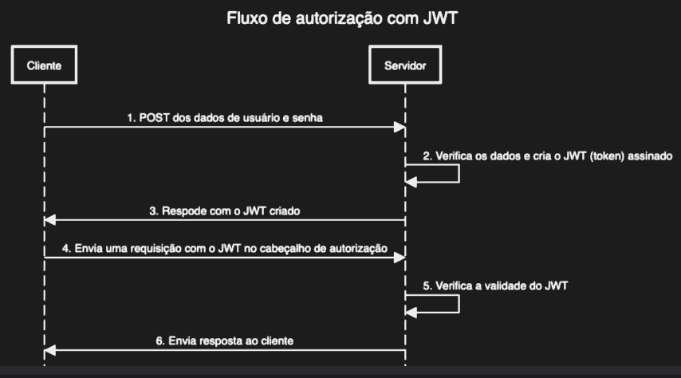

# Segurança e Autenticação
**Autenticação de Usuário**: forma de provar uma identificação de usuários garantindo que ele é quem afirma.

**Autorização**: processo de segurança que determina o nível de acesso de um usuário ou serviço;
- Depende da autenticação;
- Função: especificar direitos/privilégios de acesso a recursos;

## Autorização
Pouca segura:
- Senhas simples;
- Senhas salvas no banco sem hashing;
- Envio de senha em todas as requisições;
- Login sem timeout;
- Troca de dados não criptografada;


Muito segura:
- Senhas complexas;
- Senhas salvas com hashing e sal;
- Uso de id de sessão ou token;
- Troca de dados criptografada (HTTPS + SSL);
- Login timeout;

### Senhas complexas
Pode ser feita na interface do usuário (front-end) com JS. Usar uma expressão regular, garantindo (exemplo):
- Pelo menos 8 caracteres;
- Pelo menos 1 número;
- Pelo menos uma letra em maiúsculo/minúsculo;
- Pelo menos um caractere especial;

```js
let senha = '34a$rc0P';

// Regex que verifica TODOS os requisitos de uma vez:
// (?=.*[a-z]): pelo menos uma letra minúscula
// (?=.*[A-Z]): pelo menos uma letra maiúscula
// (?=.*[0-9]): pelo menos um número
// (?=.*[@#*$%^&+!=]): pelo menos um caractere especial
// (?=.{8,}): pelo menos 8 caracteres no total

let regex = /(?=[A-Za-z0-9@#*$%^&+!=]+$)^(?=.*[a-z])(?=.*[A-Z])(?=.*[0-9])(?=.*[@#*$%^&+!=])(?=.{8,}).*$/g;

// .match() retorna um array se a senha bater com a regex, ou null se não bater
if(senha.match(regex)){
  console.log('ok');
}
```

### Senhas salvas com hashing e sal;
**Hashing** é um processo mais seguro que a criptografia. O objetivo da criptografia é criptografar e descriptografar. Já no hashing, depois de codificado, não é possível voltar ao valor original, só é possível comparar se um determinado valor corresponde ao valor criptografado.

**Sal** é necessário para gerar um valor único de hashing, e deve ser gerado de forma aleatória.

```js
import bcrypt from 'bcryptjs'; // Biblioteca de hashing

// Hashing da senha:
const salt = bcrypt.genSaltSync();
const hashedPassWord = bcrpyt.hashSync(request.body.password, salt);

// Cadastrar usuário:
User.create({
  email: request.body.email,
  password: hashedPassWord
});

// Comparar senha:
const isEqual = bcrypt.compareSync(request.body.senha, user.password);

if(!isEqual){
  response.status(401).send('Usuário e senha inválidos!');
} else {
  // Senha válida, logar no sistema
}
```
### Uso de id de sessão ou token;
Autenticação baseada em **Id de Sessão**:
  - Após o usuário se autenticar pela primeira vez, o servidor salva os dados do usuário no banco de dados e gera um identificador único (o Id de sessão);
  - Esse id é enviado ao cliente e geralmente armazenado em um cookie no navegador;
  - Em cada nova requisição, o cliente envia esse id e o servidor consulta seu BD para verificar se aquele id ainda é válido e a quem ele pertence para permitir o acesso.

Em uma autenticação baseada em **Token** (JWT):
  - O servidor gera um token assinado e criptografado contendo as informações do usuário;
  - É considerado um método mais escalável, pois o servidor não precisa fazer consultas contínuas ao BD para validar a sessão, ele apenas verifica a assinatura digital do token para garantir que ele nunca foi alterado.

```js
import jwt from 'jsonwebtoken';

const secret = process.env['AUTH_SECRET'];

const taken = jwt.sign(
  {
    sub: user.id.
    email: user.email
  },
  secret,
  {
    expiresIn: '7d'
  }
);

response.status(201).send({token: token});

async function validarToken(request, response){
  const token = request.cookies.token;
  try{
    let payload = jwt.verify(token, segredo);
    
    return response.send(true);
  } catch(e){
    return response.send(false);
  }
}
```

Em ambos os casos, o servidor deve cuidar do tempo de expiração do Id ou Token.

### Troca de dados criptografada (HTTPS + SSL);
**HTTPS** (Protocolo de Transferência de Hipertexto Seguro): protocolo específico para transferir dados e mensagens Web utilizando TLS ou SSL.

**TLS/SSL** (Transport Layer Security/Secure Socket Layer): protocolos que criam uma conexão segura entre um navegador e um servidor. O TLS é preferido.
- Objetivos:
  - Certificar que o servidor web acessado é operado pelo proprietário legítimo do domínio;
  - Criptografar o tráfego entre o servidor e o navegador;
- O visitante acessa um site com o certificado SSL instalado;
- Uma conexão SSL segura é solicitada ao servidor onde o site está hospedado;
- O servidor responde com um certificado SSL válido;
- Uma conexão segura é estabelecida entre o navegador e o servidor, permitindo a transferência de dados criptografados.
  
### Login timeout;
**Tempo de expiração de login**, independente do fato de ser utilizado sessão ou token. `expiresIn` no JWT.

## JSON Web Token (JWT)
Padrão aberto usado para compartilhar as informações entre duas entidades, geralmente um cliente (front) e um servidor (back).

Cada JWT é assinado usando criptografia para garantir que o conteúdo JSON (declarações JWT) não possa ser alterado pelo cliente ou por terceiros.

Um JWT é estruturado em três partes: cabeçalho (header), payload (conteúdo) e assinatura (signature):
- **Cabeçalho (header)**: consiste no algoritmo de assinatura que está sendo usado e o tipo de token (JWT);
  ```js
  {
    'alg': 'HS246',
    'typ': 'JWT'
  }
  ```
- **Payload (conteúdo)**: contém as declarações (objeto JSON);
  ```js
  {
    'sub': 15,
    'email': 'alec.aoki@usp.br',
    'iat': 1681151636,
    'exp': 1681756436
  }
  ```
- **Assinatura (signature)**: uma string gerada por um algoritmo criptográfico que pode ser usada para verificar a integridade da carga JSON;
  ```js
  HMACSHA256(
    base64UrlEncode(header) + '.' +
    base64UrlEncode(payload),
    jnd791h293h7881dsn
  )
  ```

Convenção para gerar o payload do JWT:
- **iss**: emissor do token;
- **sub**: ID de usuário;
- **email**: e-mail do usuário final;
- **email_verified**: se o usuário verificou ou não seu e-mail
- **iat**: timestamp em que o JWT foi criado
- **exp**: timestamp em que o JWT irá expirar
- **admin**: se o usuário é ou não administrador



### Autenticação no Node.js
Adicionar uma autorização à uma aplicação Node.js com Express é simples, pois é só adicionar mais uma função middleware nas requisições. Vamos usar o padrão JWT.

Baixando pacotes necessários:
```bash
npm i bcryptjs
npm i jsonwebtoken
```

```js
// /models/user.model.js
import {Model, DataTypes} from 'sequelize';
import sequelize from './dbconfig.js';

class User extends Model{};

User.init(
    {
        id: {
            type: DataTypes.INTEGER,
            autoIncrement: true,
            primaryKey: true
        },
        email: {
            type: DataTypes.STRING.
            allowNull: false,
            unique: true
        },
        password: {
            type: DataTypes.STRING,
            allowNull: false
        }
    },
    {
        sequelize: sequelize,
        timestamps: false
    }
);

export default User;
```

```js
// /controllers/auth.controller.js
async function register(request, response){
    if(!request.body.password || !request.body.email){
        response.status(400).send('Informe usuário e senha');
    }

    let user = await User.findOne({
        where: {
            email: request.body.email
        }
    });

    if(user){
        response.status(400).send('Usuários já cadastrado');
    }
}
```